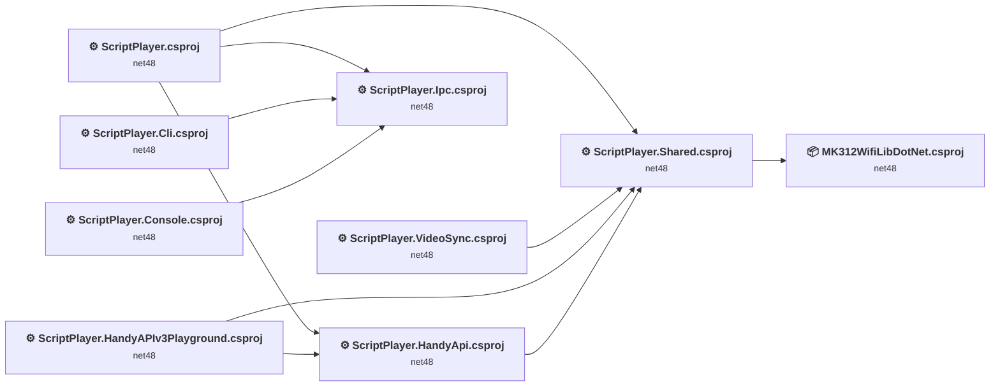
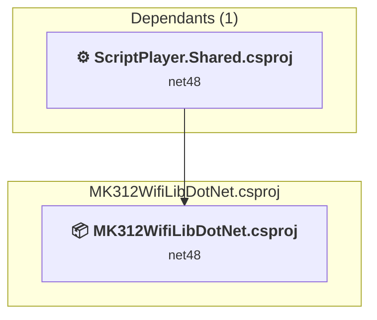
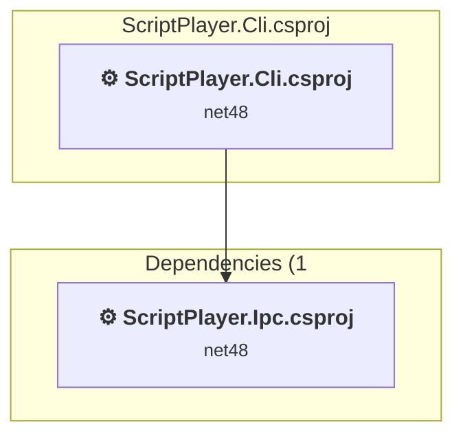
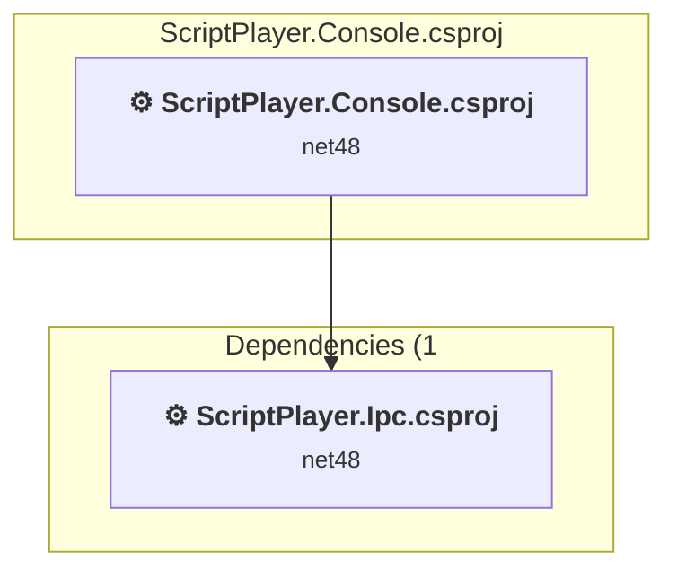
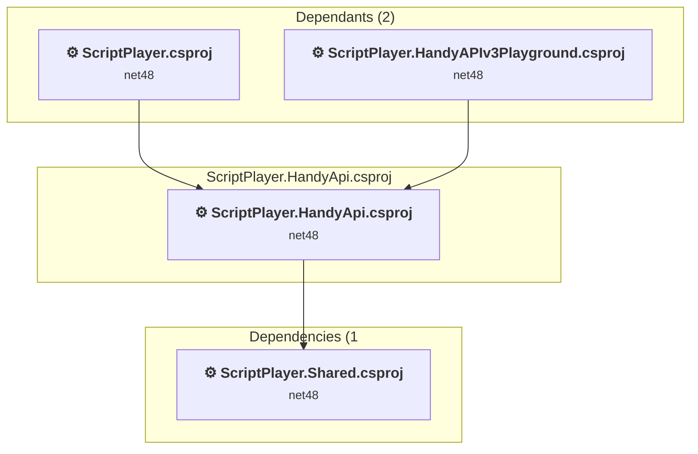
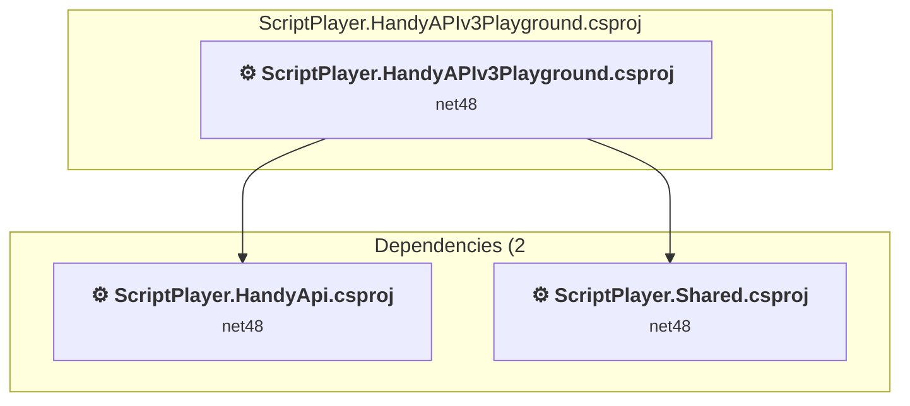
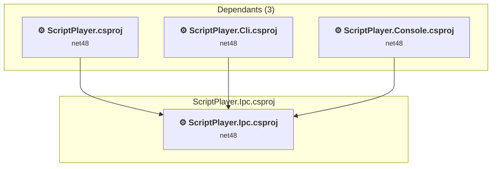
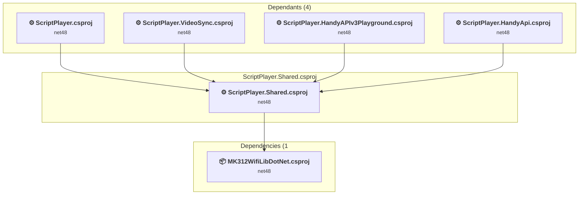
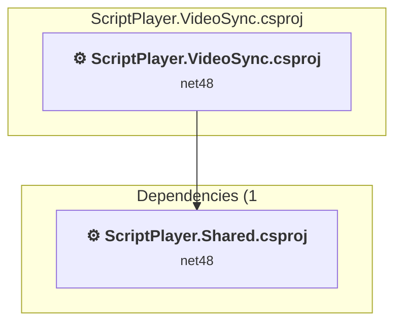
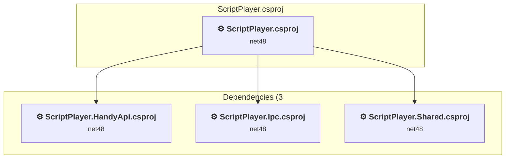

# Projects and dependencies analysis

This document provides a comprehensive overview of the projects and their dependencies in the context of upgrading to .NETCoreApp,Version=v10.0.

## Table of Contents

- [Executive Summary](#executive-Summary)
  - [Highlevel Metrics](#highlevel-metrics)
  - [Projects Compatibility](#projects-compatibility)
  - [Package Compatibility](#package-compatibility)
  - [API Compatibility](#api-compatibility)
- [Aggregate NuGet packages details](#aggregate-nuget-packages-details)
- [Top API Migration Challenges](#top-api-migration-challenges)
  - [Technologies and Features](#technologies-and-features)
  - [Most Frequent API Issues](#most-frequent-api-issues)
- [Projects Relationship Graph](#projects-relationship-graph)
- [Project Details](#project-details)

  - [MK312WifiDotNetLib\MK312WifiLibDotNet.csproj](#mk312wifidotnetlibmk312wifilibdotnetcsproj)
  - [ScriptPlayer.Cli\ScriptPlayer.Cli.csproj](#scriptplayercliscriptplayerclicsproj)
  - [ScriptPlayer.Console\ScriptPlayer.Console.csproj](#scriptplayerconsolescriptplayerconsolecsproj)
  - [ScriptPlayer.HandyApi\ScriptPlayer.HandyApi.csproj](#scriptplayerhandyapiscriptplayerhandyapicsproj)
  - [ScriptPlayer.HandyAPIv3Playground\ScriptPlayer.HandyAPIv3Playground.csproj](#scriptplayerhandyapiv3playgroundscriptplayerhandyapiv3playgroundcsproj)
  - [ScriptPlayer.Ipc\ScriptPlayer.Ipc.csproj](#scriptplayeripcscriptplayeripccsproj)
  - [ScriptPlayer.Shared\ScriptPlayer.Shared.csproj](#scriptplayersharedscriptplayersharedcsproj)
  - [ScriptPlayer.VideoSync\ScriptPlayer.VideoSync.csproj](#scriptplayervideosyncscriptplayervideosynccsproj)
  - [ScriptPlayer\ScriptPlayer.csproj](#scriptplayerscriptplayercsproj)

## Executive Summary

### Highlevel Metrics

| Metric | Count | Status |
| :--- | :---: | :--- |
| Total Projects | 9 | All require upgrade |
| Total NuGet Packages | 29 | 7 need upgrade |
| Total Code Files | 380 |  |
| Total Code Files with Incidents | 199 |  |
| Total Lines of Code | 64120 |  |
| Total Number of Issues | 9680 |  |
| Estimated LOC to modify | 9644+ | at least 15,0% of codebase |

### Projects Compatibility

| Project | Target Framework | Difficulty | Package Issues | API Issues | Est. LOC Impact | Description |
| :--- | :---: | :---: | :---: | :---: | :---: | :--- |
| [MK312WifiDotNetLib\MK312WifiLibDotNet.csproj](#mk312wifidotnetlibmk312wifilibdotnetcsproj) | net48 | 🟢 Low | 0 | 30 | 30+ | ClassLibrary, Sdk Style = True |
| [ScriptPlayer.Cli\ScriptPlayer.Cli.csproj](#scriptplayercliscriptplayerclicsproj) | net48 | 🟢 Low | 0 | 0 |  | ClassicWinForms, Sdk Style = False |
| [ScriptPlayer.Console\ScriptPlayer.Console.csproj](#scriptplayerconsolescriptplayerconsolecsproj) | net48 | 🟢 Low | 0 | 0 |  | ClassicDotNetApp, Sdk Style = False |
| [ScriptPlayer.HandyApi\ScriptPlayer.HandyApi.csproj](#scriptplayerhandyapiscriptplayerhandyapicsproj) | net48 | 🟢 Low | 1 | 37 | 37+ | ClassicWpf, Sdk Style = False |
| [ScriptPlayer.HandyAPIv3Playground\ScriptPlayer.HandyAPIv3Playground.csproj](#scriptplayerhandyapiv3playgroundscriptplayerhandyapiv3playgroundcsproj) | net48 | 🟢 Low | 1 | 15 | 15+ | ClassicWpf, Sdk Style = False |
| [ScriptPlayer.Ipc\ScriptPlayer.Ipc.csproj](#scriptplayeripcscriptplayeripccsproj) | net48 | 🟢 Low | 0 | 0 |  | ClassicClassLibrary, Sdk Style = False |
| [ScriptPlayer.Shared\ScriptPlayer.Shared.csproj](#scriptplayersharedscriptplayersharedcsproj) | net48 | 🟡 Medium | 11 | 5123 | 5123+ | ClassicWpf, Sdk Style = False |
| [ScriptPlayer.VideoSync\ScriptPlayer.VideoSync.csproj](#scriptplayervideosyncscriptplayervideosynccsproj) | net48 | 🟡 Medium | 0 | 1090 | 1090+ | ClassicWpf, Sdk Style = False |
| [ScriptPlayer\ScriptPlayer.csproj](#scriptplayerscriptplayercsproj) | net48 | 🟡 Medium | 6 | 3349 | 3349+ | ClassicWinForms, Sdk Style = False |

### Package Compatibility

| Status | Count | Percentage |
| :--- | :---: | :---: |
| ✅ Compatible | 22 | 75,9% |
| ⚠️ Incompatible | 3 | 10,3% |
| 🔄 Upgrade Recommended | 4 | 13,8% |
| ***Total NuGet Packages*** | ***29*** | ***100%*** |

### API Compatibility

| Category | Count | Impact |
| :--- | :---: | :--- |
| 🔴 Binary Incompatible | 9210 | High - Require code changes |
| 🟡 Source Incompatible | 352 | Medium - Needs re-compilation and potential conflicting API error fixing |
| 🔵 Behavioral change | 82 | Low - Behavioral changes that may require testing at runtime |
| ✅ Compatible | 45754 |  |
| ***Total APIs Analyzed*** | ***55398*** |  |

## Aggregate NuGet packages details

| Package | Current Version | Suggested Version | Projects | Description |
| :--- | :---: | :---: | :--- | :--- |
| Buttplug | 2.0.6 |  | [ScriptPlayer.Shared.csproj](#scriptplayersharedscriptplayersharedcsproj) | ✅Compatible |
| ButtplugRustFFI | 2.0.5 |  | [ScriptPlayer.Shared.csproj](#scriptplayersharedscriptplayersharedcsproj) | ⚠️Das NuGet-Paket ist veraltet |
| FMUtils.KeyboardHook | 1.0.140.2145 |  | [ScriptPlayer.csproj](#scriptplayerscriptplayercsproj) | ⚠️Das NuGet-Paket ist nicht kompatibel |
| Google.Protobuf | 3.19.1 |  | [ScriptPlayer.Shared.csproj](#scriptplayersharedscriptplayersharedcsproj) | ✅Compatible |
| HtmlAgilityPack | 1.11.43 |  | [ScriptPlayer.csproj](#scriptplayerscriptplayercsproj) [ScriptPlayer.Shared.csproj](#scriptplayersharedscriptplayersharedcsproj) | ✅Compatible |
| JetBrains.Annotations | 2022.1.0 |  | [ScriptPlayer.csproj](#scriptplayerscriptplayercsproj) [ScriptPlayer.HandyAPIv3Playground.csproj](#scriptplayerhandyapiv3playgroundscriptplayerhandyapiv3playgroundcsproj) [ScriptPlayer.Shared.csproj](#scriptplayersharedscriptplayersharedcsproj) | ✅Compatible |
| MediaInfo.Native | 21.9.1 |  | [ScriptPlayer.csproj](#scriptplayerscriptplayercsproj) [ScriptPlayer.Shared.csproj](#scriptplayersharedscriptplayersharedcsproj) | ✅Compatible |
| MediaInfo.Wrapper | 21.9.2 |  | [ScriptPlayer.csproj](#scriptplayerscriptplayercsproj) [ScriptPlayer.Shared.csproj](#scriptplayersharedscriptplayersharedcsproj) | ⚠️Das NuGet-Paket ist nicht kompatibel |
| Microsoft.AspNet.WebApi.Client | 5.2.9 |  | [ScriptPlayer.Shared.csproj](#scriptplayersharedscriptplayersharedcsproj) | ✅Compatible |
| Microsoft.CSharp | 4.7.0 |  | [ScriptPlayer.Shared.csproj](#scriptplayersharedscriptplayersharedcsproj) | ✅Compatible |
| Microsoft.Win32.Registry | 4.7.0 |  | [ScriptPlayer.csproj](#scriptplayerscriptplayercsproj) [ScriptPlayer.Shared.csproj](#scriptplayersharedscriptplayersharedcsproj) | Die Funktionalität des NuGet-Pakets ist im Frameworkverweis enthalten |
| Microsoft.WindowsAPICodePack-Core | 1.1.0.2 |  | [ScriptPlayer.csproj](#scriptplayerscriptplayercsproj) | ✅Compatible |
| Microsoft.WindowsAPICodePack-Shell | 1.1.0.0 |  | [ScriptPlayer.csproj](#scriptplayerscriptplayercsproj) | ✅Compatible |
| NAudio | 2.1.0 |  | [ScriptPlayer.csproj](#scriptplayerscriptplayercsproj) [ScriptPlayer.Shared.csproj](#scriptplayersharedscriptplayersharedcsproj) | ✅Compatible |
| NAudio.Asio | 2.1.0 |  | [ScriptPlayer.csproj](#scriptplayerscriptplayercsproj) [ScriptPlayer.Shared.csproj](#scriptplayersharedscriptplayersharedcsproj) | ✅Compatible |
| NAudio.Core | 2.1.0 |  | [ScriptPlayer.csproj](#scriptplayerscriptplayercsproj) [ScriptPlayer.Shared.csproj](#scriptplayersharedscriptplayersharedcsproj) | ✅Compatible |
| NAudio.Midi | 2.1.0 |  | [ScriptPlayer.csproj](#scriptplayerscriptplayercsproj) [ScriptPlayer.Shared.csproj](#scriptplayersharedscriptplayersharedcsproj) | ✅Compatible |
| NAudio.Wasapi | 2.1.0 |  | [ScriptPlayer.csproj](#scriptplayerscriptplayercsproj) [ScriptPlayer.Shared.csproj](#scriptplayersharedscriptplayersharedcsproj) | ✅Compatible |
| NAudio.WinForms | 2.1.0 |  | [ScriptPlayer.csproj](#scriptplayerscriptplayercsproj) [ScriptPlayer.Shared.csproj](#scriptplayersharedscriptplayersharedcsproj) | ✅Compatible |
| NAudio.WinMM | 2.1.0 |  | [ScriptPlayer.csproj](#scriptplayerscriptplayercsproj) [ScriptPlayer.Shared.csproj](#scriptplayersharedscriptplayersharedcsproj) | ✅Compatible |
| Newtonsoft.Json | 13.0.1 | 13.0.4 | [ScriptPlayer.csproj](#scriptplayerscriptplayercsproj) [ScriptPlayer.HandyApi.csproj](#scriptplayerhandyapiscriptplayerhandyapicsproj) [ScriptPlayer.HandyAPIv3Playground.csproj](#scriptplayerhandyapiv3playgroundscriptplayerhandyapiv3playgroundcsproj) [ScriptPlayer.Shared.csproj](#scriptplayersharedscriptplayersharedcsproj) | Ein NuGet-Paketupgrade wird empfohlen |
| Octokit | 0.51.0 |  | [ScriptPlayer.csproj](#scriptplayerscriptplayercsproj) | ✅Compatible |
| System.Buffers | 4.5.1 |  | [ScriptPlayer.Shared.csproj](#scriptplayersharedscriptplayersharedcsproj) | Die Funktionalität des NuGet-Pakets ist im Frameworkverweis enthalten |
| System.Memory | 4.5.4 |  | [ScriptPlayer.Shared.csproj](#scriptplayersharedscriptplayersharedcsproj) | Die Funktionalität des NuGet-Pakets ist im Frameworkverweis enthalten |
| System.Numerics.Vectors | 4.5.0 |  | [ScriptPlayer.Shared.csproj](#scriptplayersharedscriptplayersharedcsproj) | Die Funktionalität des NuGet-Pakets ist im Frameworkverweis enthalten |
| System.Runtime.CompilerServices.Unsafe | 4.5.3 | 6.1.2 | [ScriptPlayer.Shared.csproj](#scriptplayersharedscriptplayersharedcsproj) | Ein NuGet-Paketupgrade wird empfohlen |
| System.Security.AccessControl | 4.7.0 | 6.0.1 | [ScriptPlayer.csproj](#scriptplayerscriptplayercsproj) [ScriptPlayer.Shared.csproj](#scriptplayersharedscriptplayersharedcsproj) | Ein NuGet-Paketupgrade wird empfohlen |
| System.Security.Principal.Windows | 4.7.0 |  | [ScriptPlayer.csproj](#scriptplayerscriptplayercsproj) [ScriptPlayer.Shared.csproj](#scriptplayersharedscriptplayersharedcsproj) | Die Funktionalität des NuGet-Pakets ist im Frameworkverweis enthalten |
| System.Threading.Tasks.Dataflow | 4.11.1 | 10.0.2 | [ScriptPlayer.Shared.csproj](#scriptplayersharedscriptplayersharedcsproj) | Ein NuGet-Paketupgrade wird empfohlen |

## Top API Migration Challenges

### Technologies and Features

| Technology | Issues | Percentage | Migration Path |
| :--- | :---: | :---: | :--- |
| WPF (Windows Presentation Foundation) | 4141 | 42,9% | WPF APIs for building Windows desktop applications with XAML-based UI that are available in .NET on Windows. WPF provides rich desktop UI capabilities with data binding and styling. Enable Windows Desktop support: Option 1 (Recommended): Target net9.0-windows; Option 2: Add <UseWindowsDesktop>true</UseWindowsDesktop>. |
| Windows Forms | 9 | 0,1% | Windows Forms APIs for building Windows desktop applications with traditional Forms-based UI that are available in .NET on Windows. Enable Windows Desktop support: Option 1 (Recommended): Target net9.0-windows; Option 2: Add <UseWindowsDesktop>true</UseWindowsDesktop>; Option 3 (Legacy): Use Microsoft.NET.Sdk.WindowsDesktop SDK. |
| Legacy Configuration System | 6 | 0,1% | Legacy XML-based configuration system (app.config/web.config) that has been replaced by a more flexible configuration model in .NET Core. The old system was rigid and XML-based. Migrate to Microsoft.Extensions.Configuration with JSON/environment variables; use System.Configuration.ConfigurationManager NuGet package as interim bridge if needed. |

### Most Frequent API Issues

| API | Count | Percentage | Category |
| :--- | :---: | :---: | :--- |
| T:System.Windows.DependencyProperty | 861 | 8,9% | Binary Incompatible |
| M:System.Windows.DependencyObject.GetValue(System.Windows.DependencyProperty) | 275 | 2,9% | Binary Incompatible |
| M:System.Windows.DependencyObject.SetValue(System.Windows.DependencyProperty,System.Object) | 265 | 2,7% | Binary Incompatible |
| T:System.Windows.Point | 217 | 2,3% | Binary Incompatible |
| T:System.Windows.Input.Key | 207 | 2,1% | Binary Incompatible |
| T:System.Windows.RoutedEventArgs | 207 | 2,1% | Binary Incompatible |
| M:System.TimeSpan.FromSeconds(System.Double) | 165 | 1,7% | Source Incompatible |
| T:System.Windows.DependencyObject | 155 | 1,6% | Binary Incompatible |
| T:System.Windows.Rect | 152 | 1,6% | Binary Incompatible |
| T:System.Windows.Media.Color | 144 | 1,5% | Binary Incompatible |
| T:System.Windows.Input.ModifierKeys | 128 | 1,3% | Binary Incompatible |
| T:System.Windows.Size | 126 | 1,3% | Binary Incompatible |
| T:System.Windows.Media.SolidColorBrush | 102 | 1,1% | Binary Incompatible |
| T:System.Windows.MessageBoxButton | 100 | 1,0% | Binary Incompatible |
| T:System.Windows.Window | 99 | 1,0% | Binary Incompatible |
| T:System.Windows.MessageBoxImage | 98 | 1,0% | Binary Incompatible |
| M:System.TimeSpan.FromMilliseconds(System.Double) | 98 | 1,0% | Source Incompatible |
| M:System.Windows.Window.#ctor | 98 | 1,0% | Binary Incompatible |
| T:System.Windows.Media.MediaPlayer | 92 | 1,0% | Binary Incompatible |
| M:System.Windows.Point.#ctor(System.Double,System.Double) | 91 | 0,9% | Binary Incompatible |
| T:System.Windows.Threading.Dispatcher | 90 | 0,9% | Binary Incompatible |
| T:System.Windows.Media.Brushes | 81 | 0,8% | Binary Incompatible |
| T:System.Windows.MessageBoxResult | 80 | 0,8% | Binary Incompatible |
| T:System.Windows.Media.Brush | 79 | 0,8% | Binary Incompatible |
| P:System.Windows.FrameworkElement.ActualWidth | 67 | 0,7% | Binary Incompatible |
| T:System.Windows.Media.Colors | 65 | 0,7% | Binary Incompatible |
| T:System.Windows.DependencyPropertyChangedEventArgs | 62 | 0,6% | Binary Incompatible |
| P:System.Windows.FrameworkElement.ActualHeight | 58 | 0,6% | Binary Incompatible |
| T:System.Windows.Media.GradientStopCollection | 57 | 0,6% | Binary Incompatible |
| T:System.Windows.Controls.Primitives.Thumb | 57 | 0,6% | Binary Incompatible |
| P:System.Windows.Point.X | 55 | 0,6% | Binary Incompatible |
| T:System.Windows.RoutedEventHandler | 52 | 0,5% | Binary Incompatible |
| T:System.Windows.MessageBox | 50 | 0,5% | Binary Incompatible |
| T:System.Windows.Media.ImageSource | 49 | 0,5% | Binary Incompatible |
| T:System.Windows.Media.DrawingContext | 49 | 0,5% | Binary Incompatible |
| T:System.Windows.Media.GradientStop | 49 | 0,5% | Binary Incompatible |
| P:System.Windows.Size.Height | 47 | 0,5% | Binary Incompatible |
| T:System.Windows.UIElement | 46 | 0,5% | Binary Incompatible |
| T:System.Windows.Input.MouseButtonEventArgs | 46 | 0,5% | Binary Incompatible |
| T:System.Windows.WindowState | 46 | 0,5% | Binary Incompatible |
| P:System.Windows.Size.Width | 45 | 0,5% | Binary Incompatible |
| P:System.Windows.Threading.DispatcherObject.Dispatcher | 45 | 0,5% | Binary Incompatible |
| M:System.Windows.Window.ShowDialog | 45 | 0,5% | Binary Incompatible |
| T:System.Windows.Controls.Orientation | 45 | 0,5% | Binary Incompatible |
| T:System.Uri | 43 | 0,4% | Behavioral Change |
| T:System.Windows.Application | 42 | 0,4% | Binary Incompatible |
| P:System.Windows.Window.DialogResult | 42 | 0,4% | Binary Incompatible |
| T:System.Windows.Thickness | 41 | 0,4% | Binary Incompatible |
| M:System.Windows.Media.DrawingContext.DrawRectangle(System.Windows.Media.Brush,System.Windows.Media.Pen,System.Windows.Rect) | 40 | 0,4% | Binary Incompatible |
| F:System.Windows.MessageBoxButton.OK | 38 | 0,4% | Binary Incompatible |

## Projects Relationship Graph

Legend:
📦 SDK-style project
⚙️ Classic project

## Project Details

### MK312WifiDotNetLib\MK312WifiLibDotNet.csproj

#### Project Info

- **Current Target Framework:** net48
- **Proposed Target Framework:** net10.0
- **SDK-style**: True
- **Project Kind:** ClassLibrary
- **Dependencies**: 0
- **Dependants**: 1
- **Number of Files**: 8
- **Number of Files with Incidents**: 2
- **Lines of Code**: 1480
- **Estimated LOC to modify**: 30+ (at least 2,0% of the project)

#### Dependency Graph

Legend:
📦 SDK-style project
⚙️ Classic project

### API Compatibility

| Category | Count | Impact |
| :--- | :---: | :--- |
| 🔴 Binary Incompatible | 0 | High - Require code changes |
| 🟡 Source Incompatible | 30 | Medium - Needs re-compilation and potential conflicting API error fixing |
| 🔵 Behavioral change | 0 | Low - Behavioral changes that may require testing at runtime |
| ✅ Compatible | 579 |  |
| ***Total APIs Analyzed*** | ***609*** |  |

### ScriptPlayer.Cli\ScriptPlayer.Cli.csproj

#### Project Info

- **Current Target Framework:** net48
- **Proposed Target Framework:** net10.0-windows
- **SDK-style**: False
- **Project Kind:** ClassicWinForms
- **Dependencies**: 1
- **Dependants**: 0
- **Number of Files**: 2
- **Number of Files with Incidents**: 1
- **Lines of Code**: 48
- **Estimated LOC to modify**: 0+ (at least 0,0% of the project)

#### Dependency Graph

Legend:
📦 SDK-style project
⚙️ Classic project

### API Compatibility

| Category | Count | Impact |
| :--- | :---: | :--- |
| 🔴 Binary Incompatible | 0 | High - Require code changes |
| 🟡 Source Incompatible | 0 | Medium - Needs re-compilation and potential conflicting API error fixing |
| 🔵 Behavioral change | 0 | Low - Behavioral changes that may require testing at runtime |
| ✅ Compatible | 4 |  |
| ***Total APIs Analyzed*** | ***4*** |  |

### ScriptPlayer.Console\ScriptPlayer.Console.csproj

#### Project Info

- **Current Target Framework:** net48
- **Proposed Target Framework:** net10.0
- **SDK-style**: False
- **Project Kind:** ClassicDotNetApp
- **Dependencies**: 1
- **Dependants**: 0
- **Number of Files**: 2
- **Number of Files with Incidents**: 1
- **Lines of Code**: 48
- **Estimated LOC to modify**: 0+ (at least 0,0% of the project)

#### Dependency Graph

Legend:
📦 SDK-style project
⚙️ Classic project

### API Compatibility

| Category | Count | Impact |
| :--- | :---: | :--- |
| 🔴 Binary Incompatible | 0 | High - Require code changes |
| 🟡 Source Incompatible | 0 | Medium - Needs re-compilation and potential conflicting API error fixing |
| 🔵 Behavioral change | 0 | Low - Behavioral changes that may require testing at runtime |
| ✅ Compatible | 4 |  |
| ***Total APIs Analyzed*** | ***4*** |  |

### ScriptPlayer.HandyApi\ScriptPlayer.HandyApi.csproj

#### Project Info

- **Current Target Framework:** net48
- **Proposed Target Framework:** net10.0-windows
- **SDK-style**: False
- **Project Kind:** ClassicWpf
- **Dependencies**: 1
- **Dependants**: 2
- **Number of Files**: 24
- **Number of Files with Incidents**: 5
- **Lines of Code**: 1694
- **Estimated LOC to modify**: 37+ (at least 2,2% of the project)

#### Dependency Graph

Legend:
📦 SDK-style project
⚙️ Classic project

### API Compatibility

| Category | Count | Impact |
| :--- | :---: | :--- |
| 🔴 Binary Incompatible | 12 | High - Require code changes |
| 🟡 Source Incompatible | 17 | Medium - Needs re-compilation and potential conflicting API error fixing |
| 🔵 Behavioral change | 8 | Low - Behavioral changes that may require testing at runtime |
| ✅ Compatible | 1527 |  |
| ***Total APIs Analyzed*** | ***1564*** |  |

### ScriptPlayer.HandyAPIv3Playground\ScriptPlayer.HandyAPIv3Playground.csproj

#### Project Info

- **Current Target Framework:** net48
- **Proposed Target Framework:** net10.0-windows
- **SDK-style**: False
- **Project Kind:** ClassicWpf
- **Dependencies**: 2
- **Dependants**: 0
- **Number of Files**: 6
- **Number of Files with Incidents**: 4
- **Lines of Code**: 291
- **Estimated LOC to modify**: 15+ (at least 5,2% of the project)

#### Dependency Graph

Legend:
📦 SDK-style project
⚙️ Classic project

### API Compatibility

| Category | Count | Impact |
| :--- | :---: | :--- |
| 🔴 Binary Incompatible | 13 | High - Require code changes |
| 🟡 Source Incompatible | 2 | Medium - Needs re-compilation and potential conflicting API error fixing |
| 🔵 Behavioral change | 0 | Low - Behavioral changes that may require testing at runtime |
| ✅ Compatible | 118 |  |
| ***Total APIs Analyzed*** | ***133*** |  |

#### Project Technologies and Features

| Technology | Issues | Percentage | Migration Path |
| :--- | :---: | :---: | :--- |
| Legacy Configuration System | 2 | 13,3% | Legacy XML-based configuration system (app.config/web.config) that has been replaced by a more flexible configuration model in .NET Core. The old system was rigid and XML-based. Migrate to Microsoft.Extensions.Configuration with JSON/environment variables; use System.Configuration.ConfigurationManager NuGet package as interim bridge if needed. |

### ScriptPlayer.Ipc\ScriptPlayer.Ipc.csproj

#### Project Info

- **Current Target Framework:** net48
- **Proposed Target Framework:** net10.0
- **SDK-style**: False
- **Project Kind:** ClassicClassLibrary
- **Dependencies**: 0
- **Dependants**: 3
- **Number of Files**: 5
- **Number of Files with Incidents**: 1
- **Lines of Code**: 336
- **Estimated LOC to modify**: 0+ (at least 0,0% of the project)

#### Dependency Graph

Legend:
📦 SDK-style project
⚙️ Classic project

### API Compatibility

| Category | Count | Impact |
| :--- | :---: | :--- |
| 🔴 Binary Incompatible | 0 | High - Require code changes |
| 🟡 Source Incompatible | 0 | Medium - Needs re-compilation and potential conflicting API error fixing |
| 🔵 Behavioral change | 0 | Low - Behavioral changes that may require testing at runtime |
| ✅ Compatible | 238 |  |
| ***Total APIs Analyzed*** | ***238*** |  |

### ScriptPlayer.Shared\ScriptPlayer.Shared.csproj

#### Project Info

- **Current Target Framework:** net48
- **Proposed Target Framework:** net10.0-windows
- **SDK-style**: False
- **Project Kind:** ClassicWpf
- **Dependencies**: 1
- **Dependants**: 4
- **Number of Files**: 199
- **Number of Files with Incidents**: 87
- **Lines of Code**: 32667
- **Estimated LOC to modify**: 5123+ (at least 15,7% of the project)

#### Dependency Graph

Legend:
📦 SDK-style project
⚙️ Classic project

### API Compatibility

| Category | Count | Impact |
| :--- | :---: | :--- |
| 🔴 Binary Incompatible | 4952 | High - Require code changes |
| 🟡 Source Incompatible | 134 | Medium - Needs re-compilation and potential conflicting API error fixing |
| 🔵 Behavioral change | 37 | Low - Behavioral changes that may require testing at runtime |
| ✅ Compatible | 22956 |  |
| ***Total APIs Analyzed*** | ***28079*** |  |

#### Project Technologies and Features

| Technology | Issues | Percentage | Migration Path |
| :--- | :---: | :---: | :--- |
| WPF (Windows Presentation Foundation) | 2751 | 53,7% | WPF APIs for building Windows desktop applications with XAML-based UI that are available in .NET on Windows. WPF provides rich desktop UI capabilities with data binding and styling. Enable Windows Desktop support: Option 1 (Recommended): Target net9.0-windows; Option 2: Add <UseWindowsDesktop>true</UseWindowsDesktop>. |

### ScriptPlayer.VideoSync\ScriptPlayer.VideoSync.csproj

#### Project Info

- **Current Target Framework:** net48
- **Proposed Target Framework:** net10.0-windows
- **SDK-style**: False
- **Project Kind:** ClassicWpf
- **Dependencies**: 1
- **Dependants**: 0
- **Number of Files**: 20
- **Number of Files with Incidents**: 17
- **Lines of Code**: 5951
- **Estimated LOC to modify**: 1090+ (at least 18,3% of the project)

#### Dependency Graph

Legend:
📦 SDK-style project
⚙️ Classic project

### API Compatibility

| Category | Count | Impact |
| :--- | :---: | :--- |
| 🔴 Binary Incompatible | 1058 | High - Require code changes |
| 🟡 Source Incompatible | 32 | Medium - Needs re-compilation and potential conflicting API error fixing |
| 🔵 Behavioral change | 0 | Low - Behavioral changes that may require testing at runtime |
| ✅ Compatible | 4497 |  |
| ***Total APIs Analyzed*** | ***5587*** |  |

#### Project Technologies and Features

| Technology | Issues | Percentage | Migration Path |
| :--- | :---: | :---: | :--- |
| Legacy Configuration System | 2 | 0,2% | Legacy XML-based configuration system (app.config/web.config) that has been replaced by a more flexible configuration model in .NET Core. The old system was rigid and XML-based. Migrate to Microsoft.Extensions.Configuration with JSON/environment variables; use System.Configuration.ConfigurationManager NuGet package as interim bridge if needed. |
| WPF (Windows Presentation Foundation) | 299 | 27,4% | WPF APIs for building Windows desktop applications with XAML-based UI that are available in .NET on Windows. WPF provides rich desktop UI capabilities with data binding and styling. Enable Windows Desktop support: Option 1 (Recommended): Target net9.0-windows; Option 2: Add <UseWindowsDesktop>true</UseWindowsDesktop>. |

### ScriptPlayer\ScriptPlayer.csproj

#### Project Info

- **Current Target Framework:** net48
- **Proposed Target Framework:** net10.0-windows
- **SDK-style**: False
- **Project Kind:** ClassicWinForms
- **Dependencies**: 3
- **Dependants**: 0
- **Number of Files**: 118
- **Number of Files with Incidents**: 81
- **Lines of Code**: 21605
- **Estimated LOC to modify**: 3349+ (at least 15,5% of the project)

#### Dependency Graph

Legend:
📦 SDK-style project
⚙️ Classic project

### API Compatibility

| Category | Count | Impact |
| :--- | :---: | :--- |
| 🔴 Binary Incompatible | 3175 | High - Require code changes |
| 🟡 Source Incompatible | 137 | Medium - Needs re-compilation and potential conflicting API error fixing |
| 🔵 Behavioral change | 37 | Low - Behavioral changes that may require testing at runtime |
| ✅ Compatible | 15831 |  |
| ***Total APIs Analyzed*** | ***19180*** |  |

#### Project Technologies and Features

| Technology | Issues | Percentage | Migration Path |
| :--- | :---: | :---: | :--- |
| Legacy Configuration System | 2 | 0,1% | Legacy XML-based configuration system (app.config/web.config) that has been replaced by a more flexible configuration model in .NET Core. The old system was rigid and XML-based. Migrate to Microsoft.Extensions.Configuration with JSON/environment variables; use System.Configuration.ConfigurationManager NuGet package as interim bridge if needed. |
| Windows Forms | 9 | 0,3% | Windows Forms APIs for building Windows desktop applications with traditional Forms-based UI that are available in .NET on Windows. Enable Windows Desktop support: Option 1 (Recommended): Target net9.0-windows; Option 2: Add <UseWindowsDesktop>true</UseWindowsDesktop>; Option 3 (Legacy): Use Microsoft.NET.Sdk.WindowsDesktop SDK. |
| WPF (Windows Presentation Foundation) | 1091 | 32,6% | WPF APIs for building Windows desktop applications with XAML-based UI that are available in .NET on Windows. WPF provides rich desktop UI capabilities with data binding and styling. Enable Windows Desktop support: Option 1 (Recommended): Target net9.0-windows; Option 2: Add <UseWindowsDesktop>true</UseWindowsDesktop>. |

